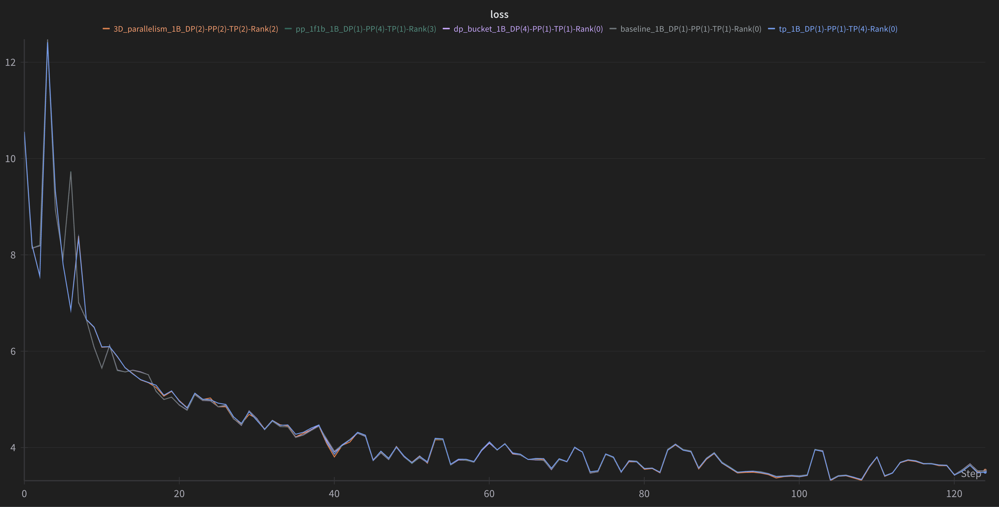

# GradSync — From-Scratch Distributed Training

GradSync is a compact, educational distributed-training framework for LLMs built
directly on `torch.distributed`. Every parallelism primitive is implemented by
hand — no Megatron, no DeepSpeed — so you can read exactly what data-parallel,
pipeline-parallel, and tensor-parallel training do under the hood.

The current build ships:

- A Llama-style model (`model.py`) with flash-attention, rotary embeddings and
  Triton RMSNorm.
- A **tensor-parallel** layer suite (`tensor_parallel.py`):
  `ColumnParallelLinear`, `RowParallelLinear`, `VocabParallelEmbedding`, and the
  `Copy`/`Reduce`/`Gather` communication primitives behind them.
- A 3D process-group grid (`process_group_manager.py`) that carves
  `dp × pp × tp` groups out of the global world, ready for DP/PP/TP mixes.
- A streaming dataloader (`dataloader.py`) that tokenizes and groups a Hugging
  Face corpus into fixed-length chunks on the fly.
- A cloud runner (`modal_train.py`) that launches multi-GPU runs on
  [Modal](https://modal.com) with zero local GPU requirements.

## Repository Layout

| File                      | Purpose                                                        |
|---------------------------|----------------------------------------------------------------|
| `model.py`                | Llama-style transformer (flash-attn, GQA, rotary embeddings)   |
| `tensor_parallel.py`      | TP primitives, parallel linears, and `apply_tensor_parallel`   |
| `process_group_manager.py`| DP × PP × TP grid and subgroup creation                         |
| `dataloader.py`           | Streaming, chunked text data loader                             |
| `train.py`                | `torchrun`-launched training entrypoint                         |
| `modal_train.py`          | Modal runner (TP2/TP4, parameterized config)                    |
| `utils.py`                | Seeding, locked printing, readable number formatting            |
| `SETUP.md`                | Step-by-step tutorial: from zero to a 3D-parallel training loop |

## Quick Start

### Locally

```bash
pip install -r requirements.txt
torchrun --nproc_per_node 2 train.py --tp_size 2 \
  --micro_batch_size 2 --gradient_accumulation_steps 4 \
  --seq_len 512 --max_tokens 40960 --num_proc 8
```

### On Modal (2 or 4 A100s)

```bash
modal run --detach modal_train.py --tp-size 2 --max-tokens 40960 --seq-len 128
```

Full production traffic shape (16 × 32000-token steps per batch):

```bash
modal run --detach modal_train.py            # TP4, seq_len 1024, mb 4, grad_acc 8
```

## Configuration

| Argument | Default | Meaning |
|---|---|---|
| `--tp_size` | 1 | Tensor-parallel degree (sharded weights, all-reduce output) |
| `--dp_size` | 1 | Data-parallel degree (replicated model, gradient all-reduce) |
| `--pp_size` | 1 | Pipeline-parallel degree (layer-partitioned stages) |
| `--micro_batch_size` × `--gradient_accumulation_steps` | 1 × 1 | Micro vs. global batch |
| `--seq_len` | 32 | Context length (also caps `max_position_embeddings`) |
| `--max_tokens` | 1M | Stop condition — total tokens trained |
| `--model_name` | SmolLM-360M | Base config + tokenizer (HuggingFace id) |

The dataloader asserts `dp_world_size × micro_batch × grad_acc × seq_len`
divides evenly into your token budget — the training loop exits after exactly
`max_tokens / tokens_per_step` steps.

## Results — TP Smoke Test

First tensor-parallel run, on **Modal (2 × A100-40GB, SXM)**, TP="2", 2026-08-08:

| Metric | Value |
|---|---|
| Model | TinyLlama/TinyLlama_v1.1 (8 layers, 32 heads, 4 KV heads, bf16) |
| Parallelism | TP=2 · DP=1 · PP=1 |
| Sequence length | 64 |
| Micro-batch / grad-accum | 1 / 1 → 64 tokens/step |
| Steps run | 1 (smoke test) |
| **Loss** | **10.5625** |
| **GPU memory / GPU** | **2.56 GB** |
| Step time | < 1 s (warmup incl.) |

A randomly initialized 32k-vocab model has expected loss `ln(32000) ≈ 10.37`
— the measured 10.56 confirms the TP graph (column→row zero-copy handoffs,
`Reduce`/`Gather`/`Copy` collectives, `VocabParallelEmbedding` range masking)
produces mathematically correct logits, gradients, and optimizer steps.

Full run logged to
[wandb](https://wandb.ai/iiserkbikram/picotron_tutorial) (`tp_1B_DP(1)-PP(1)-TP(2)-Rank(0)`).

### Validation protocol

The sanity criterion for this framework is convergence parity: every parallel
scheme must land on the same loss curve as the single-GPU baseline. To validate,
re-run the smoke test with progressively larger token budgets and check that the
loss curve stays on the baseline — parallelism must change throughput, never
results:



## Roadmap

- [x] Model + process-group grid + streaming dataloader
- [x] Tensor parallelism (MP-style) — validated on 2×A100
- [ ] Data parallelism — naive and bucketed gradient all-reduce
- [ ] Pipeline parallelism — 1F1B / AFAB schedules
- [ ] Combine all three into a 3D-parallel job

## References

- [Picotron tutorial repo](https://github.com/huggingface/picotron_tutorial) — the
  canonical "from scratch" series this repo builds from
- [SETUP.md](./SETUP.md) — the full step-by-step tutorial this repo accompanies
- [Modal](https://modal.com) — the managed GPU runner used for validation

---

*Built for understanding — every communication call in this repo is a
one-line `torch.distributed` collective; nothing is hidden behind a framework.*