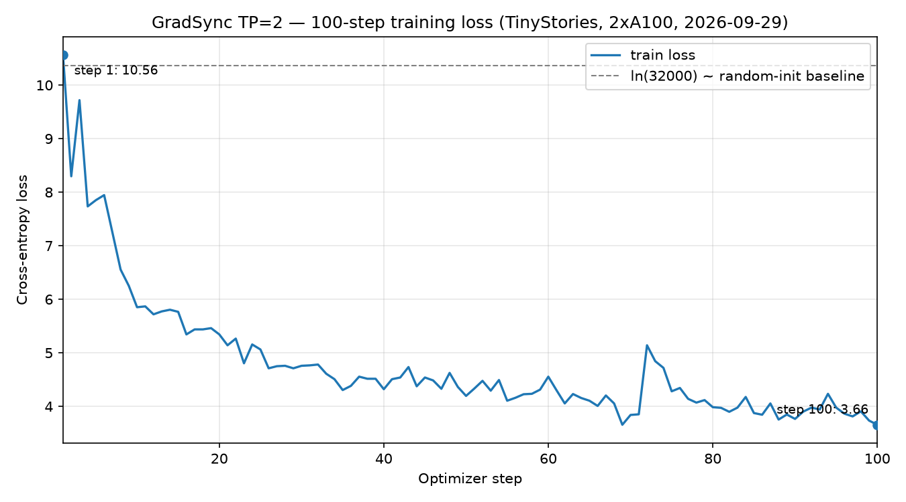

# GradSync — From-Scratch Distributed Training

GradSync is a compact, educational distributed-training framework for LLMs built
directly on `torch.distributed`. The parallel primitives are implemented by hand
— no Megatron, no DeepSpeed — so you can read exactly what a tensor-parallel
training step does under the hood.

**Status:** tensor parallelism (TP) is implemented and validated with a 100-step
convergence run on 2×A100 (see [Results](#results)).
Data- and pipeline-parallelism are planned (see [Roadmap](#roadmap)).

The current build ships:

- A Llama-style model (`model.py`): flash-attention, rotary embeddings, GQA,
  Triton RMSNorm.
- A tensor-parallel layer suite (`tensor_parallel.py`):
  `ColumnParallelLinear`, `RowParallelLinear`, `VocabParallelEmbedding`, and the
  `Copy`/`Reduce`/`Gather` communication primitives behind them.
- A 3D process-group grid (`process_group_manager.py`) that carves
  `dp × pp × tp` groups out of the global world. The TP groups are exercised
  today; the DP/PP groups are created to prepare the next steps.
- A chunked-text dataloader (`dataloader.py`) that tokenizes a Hugging Face
  corpus into fixed-length blocks (full-dataset tokenization — not streaming).
- A cloud runner (`modal_train.py`) that launches multi-GPU runs on
  [Modal](https://modal.com) with zero local GPU requirements.

## Quick Start

100-step training run (the config that has been run and validated), on Modal
2 × A100 with TP=2:

```bash
modal run modal_train.py --tp-size 2 --max-tokens 204800 --seq-len 256 \
  --micro-batch-size 2 --gradient-accumulation-steps 4 \
  --num-hidden-layers 8 --num-proc 8
```

Or, locally, the same run with `torchrun --nproc_per_node 2` and the same
arguments on `--tp_size`, `--max_tokens`, etc.

## Results

Run on **Modal (2 × A100-40GB)**, TP=2 · DP=1 · PP=1, 2026-09-29:

| Metric | Value |
|---|---|
| Model | TinyLlama/TinyLlama_v1.1 base config, 8 decoder layers, 32 heads, 4 KV heads, bf16 |
| Dataset | roneneldan/TinyStories |
| Sequence length | 256 |
| Micro-batch × grad-accum | 2 × 4 (2,048 tokens/step) |
| Optimizer | AdamW, lr 3e-4, seed 42 |
| Steps run | 100 (204,800 tokens) |
| **Loss: step 1 → step 100** | **10.5625 → 3.6562** |
| **Throughput** | **~12.8K tokens/s (~6.4K/s/GPU)** |
| **GPU memory / GPU** | **2.66 GB** |

Loss curve (training loss, TinyStories):

| Step | 1 | 10 | 25 | 50 | 75 | 100 |
|---|---|---|---|---|---|---|
| Loss | 10.56 | 5.85 | 5.06 | 4.20 | 4.28 | 3.66 |



Step 1 reproduces the random-init expectation (`ln(32000) ≈ 10.37`), and the
steady drop to 3.66 over 100 steps exercises the full TP path — `Copy`/`Reduce`/
`Gather` collectives, sharded embeddings, and backward + optimizer through the
sharded layers — showing the tensor-parallel model actually learns.

[Modal app run](https://modal.com/apps/bikrammajhi/main/ap-uIU0a8VIYJKArulYwFzzUU) —
reproduce with the Quick Start command above (exactly 100 steps: 100 × 2,048 =
204,800 `--max-tokens`).

## Roadmap

- [x] Model + process-group grid + chunked dataloader
- [x] Tensor parallelism — validated on 2×A100 (100-step run, 10.56 → 3.66)
- [ ] Data parallelism — naive and bucketed gradient all-reduce
- [ ] Pipeline parallelism — 1F1B / AFAB schedules
- [ ] 3D-parallel run + convergence-curve validation

## References

- [Picotron tutorial repo](https://github.com/huggingface/picotron_tutorial) — the
  canonical "from-scratch" series this repo builds on
- [Modal](https://modal.com) — the managed GPU runner used for validation

*Built for understanding — every communication call lands on a single
`torch.distributed` collective; nothing is hidden behind a framework.*